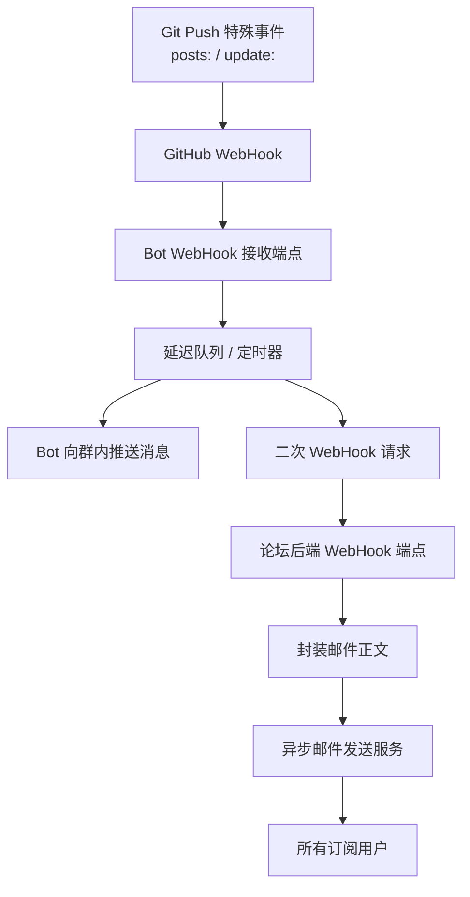

# 视频

https://www.bilibili.com/video/BV1hpDKBbES9/

# 正式开始

众所周知，目前如果你想订阅本博客，可以采用以下几种方式
- **瞪眼法** 在多次浏览中通过大脑的逻辑中枢来判断有哪些新文章，或有哪些文章更新了
- **简易瞪眼法** 在多次浏览中，若文章状态变化，右下角的小铃铛则会显示相应通知，点击后甚至可以看到高级的DIFF
	
- **RSS** 通过RSS订阅器订阅本博客的RSS XML文件，由第三方告知文章更新状态
	
- **加入群组** 通过置顶文章加入群组，群内会有Bot在文章更新时广播一条消息
	
- **催更法** 想办法要到我的联系方式，催更，大概率我会在你要求的新文章发布后踹你一脚

emm，看似很多，的确很多，但是由于多多益善，可得还不够多，所以我们准备再添加一个古法订阅

那就是 **电子邮件通知** 

实现它在现在其实非常简单，由于我们已经有了一个 [论坛](/forum/) ，可以直接在用户个人中心添加一个选项卡，勾选后即可接收后续的文章通知

我们甚至无需担心垃圾邮件，因为在注册论坛时已经有了相对严格的验证

那么接下来就是架构的设置，正如上文提到的，我们有一个提醒文章更新的Bot

实际上，最终的电子邮件发送的东西和这个东西差不多

也就是说，我们只需要让Bot在发送消息的同时，将要发送的内容推送给我们

*至于Bot是如何做到文章更新推送消息的，请参见 [这里](/posts/github-webhook/)*

那么不难想象，我们只需要在后端创建一个WebHook端点，接受Bot发送的WebHook消息，然后将正文作为邮件正文发送给订阅后的用户

最终，架构如下

ok！思路清晰了，实践就简单了

首先前往Bot插件，将 `blog_post.py` 插件添加一个二次WebHook的功能

再为论坛后端添加一个接受WebHook的端点，并绑定发邮事件。顺便再加一个API用于控制用户是否为 **订阅者** 

最终在前端对接后端API，以及添加新UI控件支持用户在论坛的个人信息页配置是否要接受新文章推送

测试！

