# 为什么要这么做？
有人说，我要接网线的话，为什么不去买成品网线？

当然可以，但是成品网线的长度是固定的，在实际环境下，我们有时候很难买到一根 **长度刚刚好** 的网线，这时，如果我们会自己打水晶头，那么问题就迎刃而解了，同时，裸线 + 水晶头相比与成品网线也相对便宜

# 准备

- 网线钳 x1
- 超五类网线裸线 x1
- 水晶头 x2
- 测线仪（自信者可忽略）

### 网线钳

- 裁剪线缆
- 剥线缆外皮，使其露出双绞线
- 裁剪过长的双绞线
- 压实水晶头两段的扣具（一段压实网线外皮，一段将金属舌刺入双绞线
	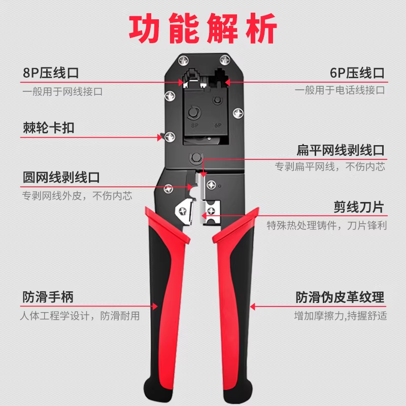

### 超五类网线裸线

- 作为网线使用
	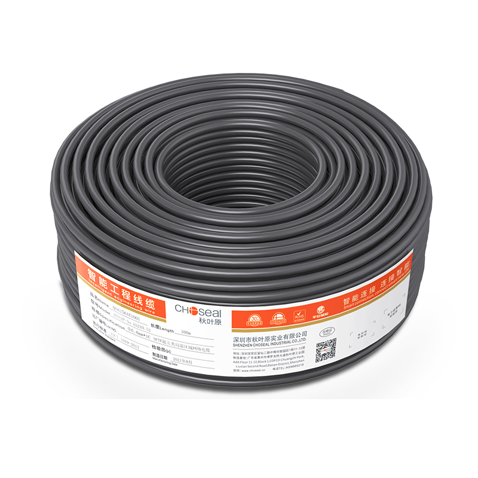

### 水晶头

- 接入裁剪后网线的两端，最后插入网络设备的网口
	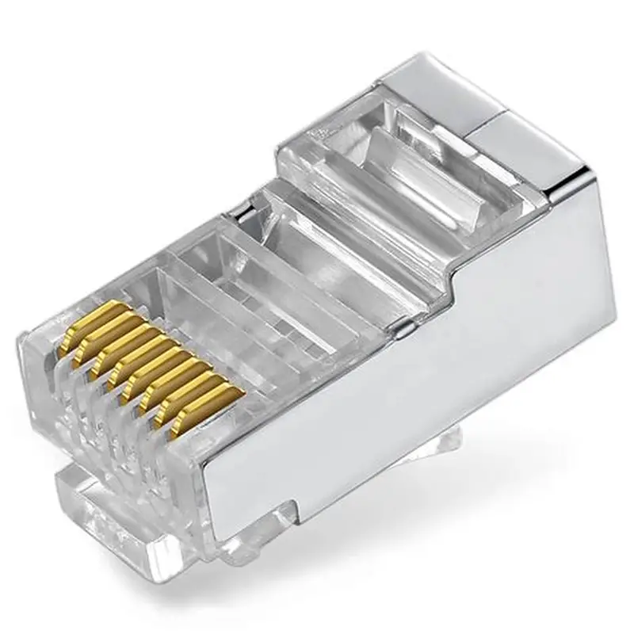
# 实操

1. 将线缆卡入网线钳的第一个线缆刀口：剪线刀口（通常较浅），裁切线缆（**实际需要的长度+5CM**，增加一点容错）
	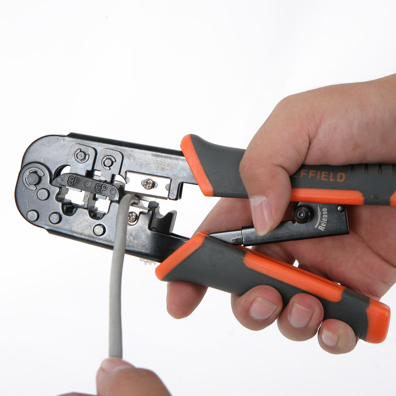
2. 将线缆卡入网线钳的第二个线缆刀口：剥线刀口（通常较深），距离大约2~4CM（初学者可以剥长一些，方便后续解双绞线，当然，剥得越长浪费的越多），将网线钳压实，并且来回旋转线缆和网线钳，最终向外剥除
	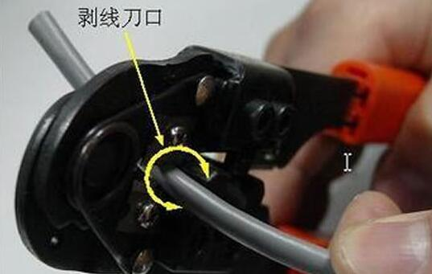

3. 此时，4对双绞线会暴露出来，分别为 **橙、绿、蓝、棕**，每对双绞线为 **一根相间线和一根纯色线**，比如 **橙线，白橙线**   
	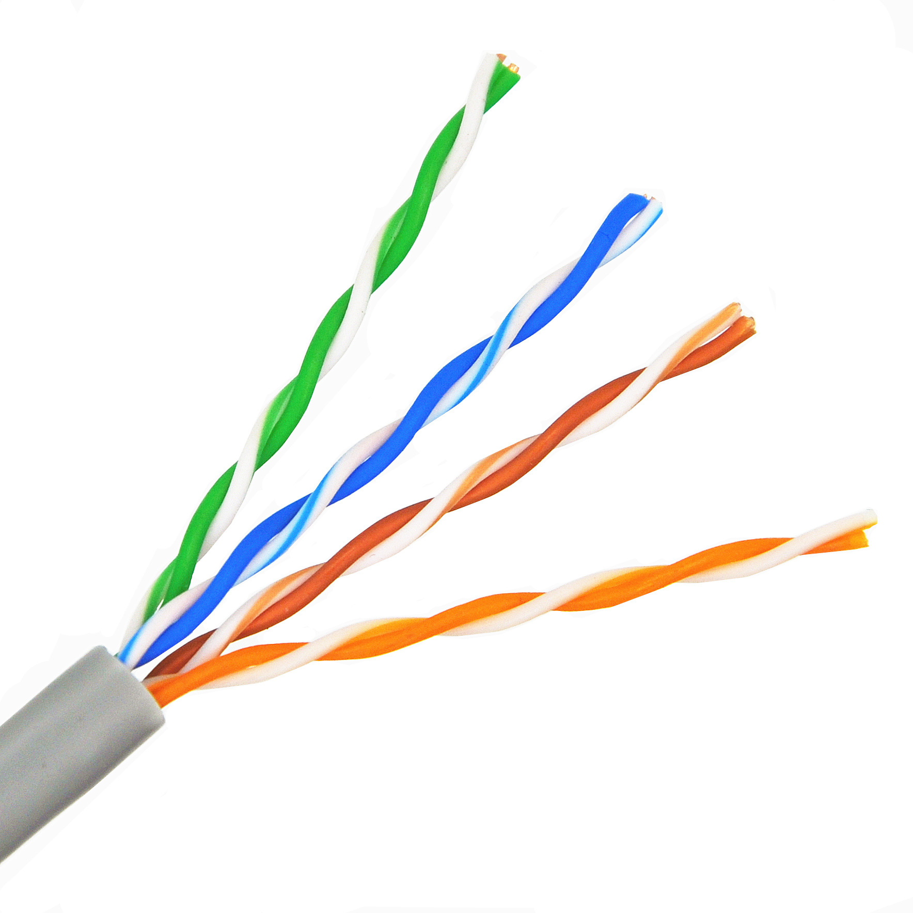
4. 我们将其全部解开，并重新排序为（T-568B线序）：**白橙，橙色，白绿，蓝色，白蓝，绿色，白棕，棕色** 。口诀为： **橙绿蓝棕**
	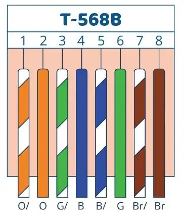
5. 理好线后一般会过长，我们需要将裸露在外的双绞线裁剪到 10~12MM 左右。将理好的线塞入网线钳的剪线刀口，将其裁断。若过长，最终会导致 **水晶头三角卡扣无法固定线缆外皮** ，导致日后脱线的隐患；若过短，则会 **无法将双绞线完全塞入水晶头内部线槽** ，最终金属舌将无法精准刺入8根线芯，导致断芯
	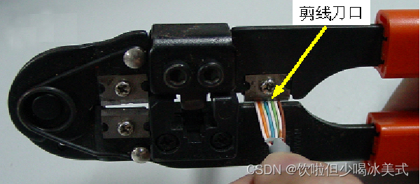
6. 将水晶头拿起，**塑料舌对外，金属舌对内**，将网线塞入水晶头
	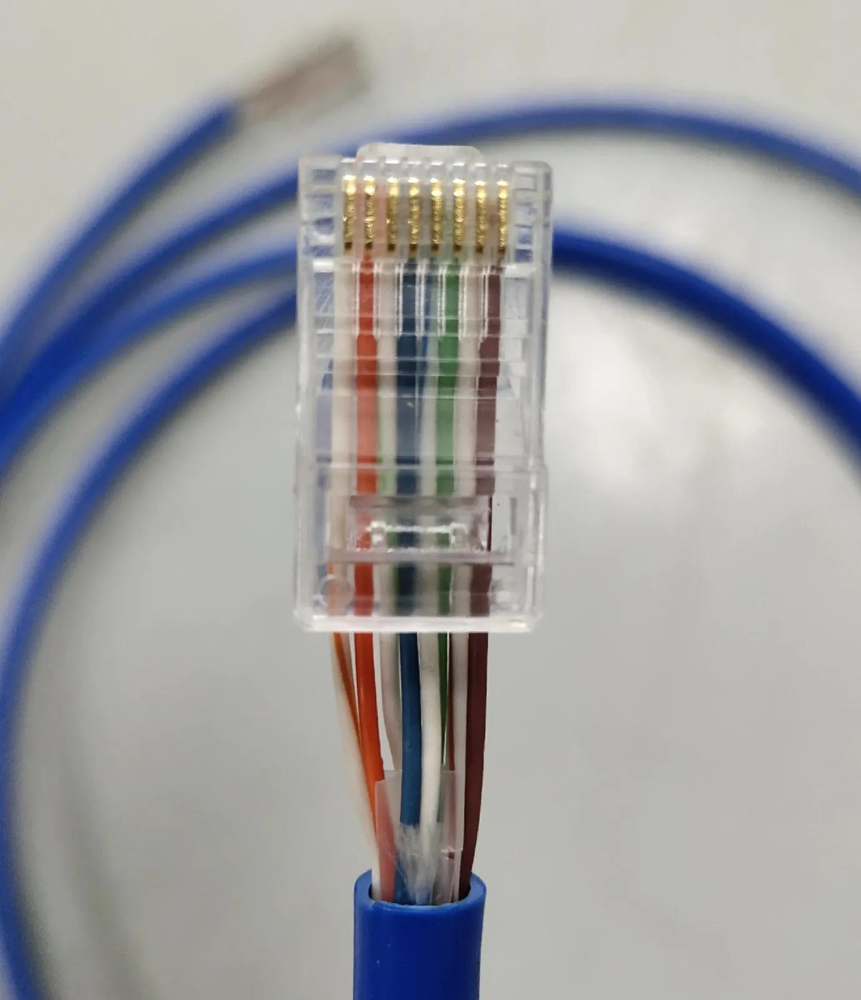
7. 接着在 **确保线序正确** 的情况下将8根线芯塞入水晶头内的线槽， **并塞紧** 。从侧面、上面观察，保证8根线芯全部怼紧，**确保水晶头上金属舌的三个针刺都能刺入线芯**，并且**塑料舌侧的三角卡扣可以压到线缆外皮**
	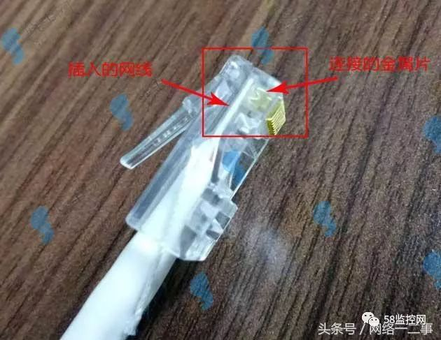

	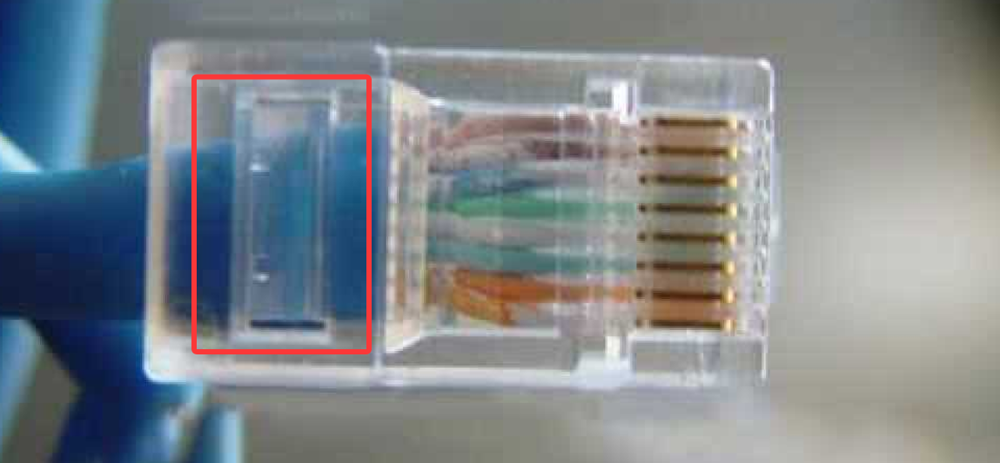
8. **不要松手** ，将还没固定的水晶头卡入剪线钳的RJ45卡口，并**保证网线钳的金属舌对准水晶头上的金属舌**（避免装反）
	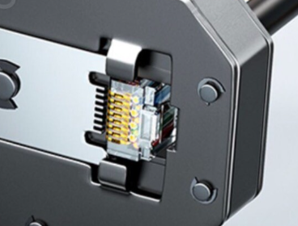
9. **此步操作后不可回滚** 。**用力压实** 网线钳，保证 **金属舌刺入8根线芯**，**塑料三角扣具压住网线外皮**。至此，一端的水晶头便已打好，另一端如法炮制即可
	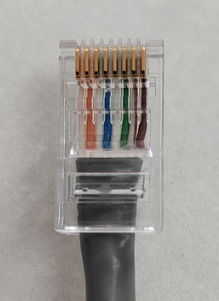
10. 将打好水晶头的网线接入测线仪测试，设置为T568B线序，**保证1-8灯按顺序亮起**，并且**稍微拉扯水晶头与线缆不脱落**，网线质量则过关，可以投入使用。若出现异常请回到第一步将废弃水晶头裁断重新开始流程
	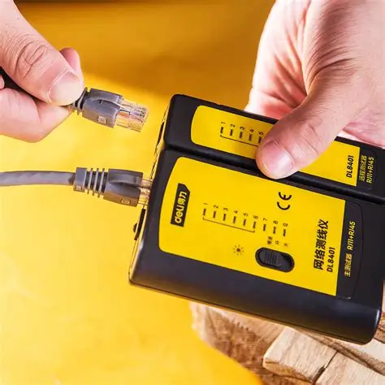