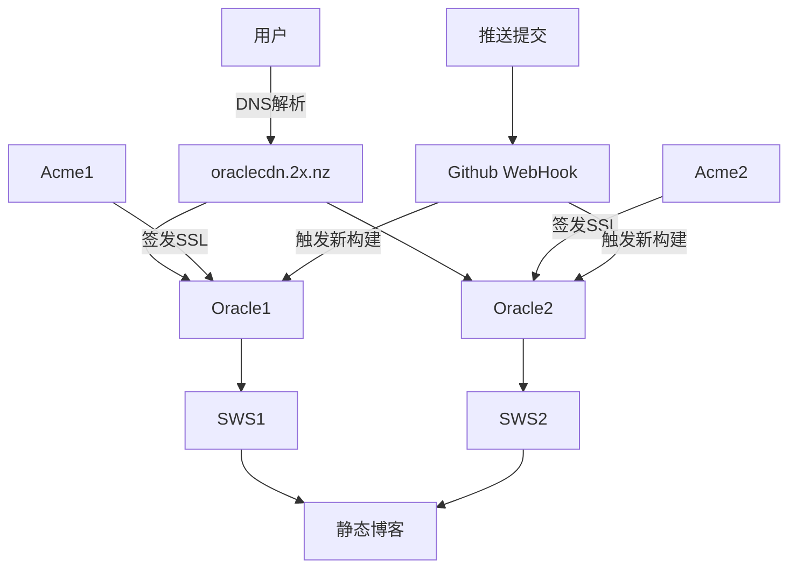
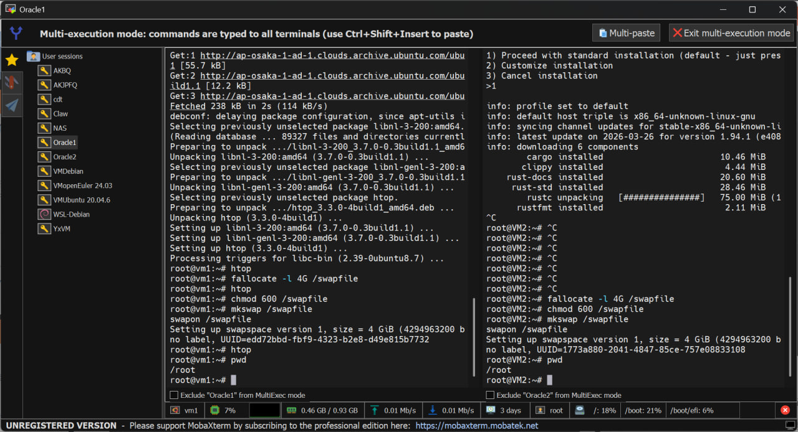
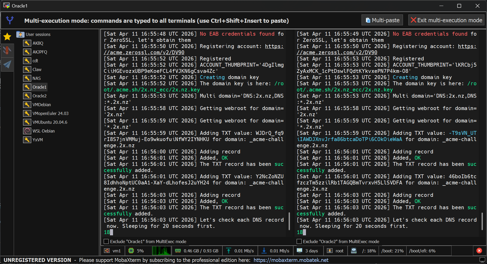

# 前情提要

因为最近搞了甲骨文，有俩1c1g的甲骨文机子，但是不知道能拿来干嘛

然后最近偶然发现甲骨文上托管HTML很绿


于是就想着是否能在我的俩甲骨文上托管我的静态博客？

# 思路

首先，我们需要一个Web服务器，用来提供HTML内容，因为我是静态博客。所有我们不需要高级功能，故选择最快的 [static-web-server/static-web-server: A cross-platform, high-performance and asynchronous web server for static files-serving. ⚡](https://github.com/static-web-server/static-web-server)

其次，我们还需要为它配置SSL，这里使用最简单的 https://acme.sh

最后，我们需要让他支持CICD。好巧不巧，我曾经写过一个基于Python的 [afoim/vps-cicd: 简易的VPS CI/CD](https://github.com/afoim/vps-cicd)

所以流程图最终大致如下



# 正式开始！

首先，使用 [MobaXterm free Xserver and tabbed SSH client for Windows](https://mobaxterm.mobatek.net/) 连上两台机子并且启用 Multi Shell！

*这样我们就可以输入一次命令，让多台机子同时执行！*



接着，我们首先下载 [static-web-server/static-web-server: A cross-platform, high-performance and asynchronous web server for static files-serving. ⚡](https://github.com/static-web-server/static-web-server) 

```bash
wget https://github.com/static-web-server/static-web-server/releases/download/v2.42.0/static-web-server-v2.42.0-x86_64-unknown-linux-gnu.tar.gz
tar -xzvf static-web-server-v2.42.0-x86_64-unknown-linux-gnu.tar.gz
rm static-web-server-v2.42.0-x86_64-unknown-linux-gnu.tar.gz
```

再然后安装 https://acme.sh

```bash
apt install cron
curl https://get.acme.sh | sh -s email=my@example.com
```

接着按照文档操作，申请证书 [dnsapi · acmesh-official/acme.sh Wiki](https://github.com/acmesh-official/acme.sh/wiki/dnsapi#dns_cf) 

```bash
./acme.sh --issue --dns dns_cf -d 2x.nz -d '*.2x.nz'
```



签发完毕后需要安装证书，指定一个目录

```bash
acme.sh --install-cert -d 2x.nz \
--key-file       /root/ssl/2x_nz_key.pem  \
--fullchain-file /root/ssl/2x_nz_cert.pem \
--reloadcmd     "service sws force-reload"
```