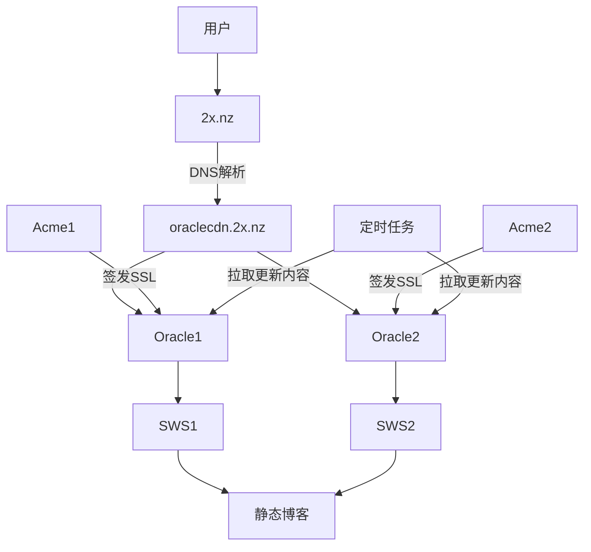

# 前情提要

因为最近搞了甲骨文，有俩1c1g的甲骨文机子，但是不知道能拿来干嘛

然后最近偶然发现甲骨文上托管HTML很绿


于是就想着是否能在我的俩甲骨文上托管我的静态博客？

# 思路

首先，我们需要一个Web服务器，用来提供HTML内容，因为我是静态博客。所有我们不需要高级功能，故选择最快的 [static-web-server/static-web-server: A cross-platform, high-performance and asynchronous web server for static files-serving. ⚡](https://github.com/static-web-server/static-web-server)

其次，我们还需要为它配置SSL，这里使用最简单的 https://acme.sh

最后，我们需要让他实时更新。嘛，最简单的就是写个定时任务，按照固定频次强制拉取远程仓库的最新更改

所以流程图最终大致如下



# 正式开始！

首先，使用 [MobaXterm free Xserver and tabbed SSH client for Windows](https://mobaxterm.mobatek.net/) 连上两台机子并且启用 Multi Shell！

*这样我们就可以输入一次命令，让多台机子同时执行！*


接着，我们首先下载 [static-web-server/static-web-server: A cross-platform, high-performance and asynchronous web server for static files-serving. ⚡](https://github.com/static-web-server/static-web-server) 

```bash
wget https://github.com/static-web-server/static-web-server/releases/download/v2.42.0/static-web-server-v2.42.0-x86_64-unknown-linux-gnu.tar.gz
tar -xzvf static-web-server-v2.42.0-x86_64-unknown-linux-gnu.tar.gz
rm static-web-server-v2.42.0-x86_64-unknown-linux-gnu.tar.gz
```

然后我们创建 `sws.toml` 。启用HTTP跳转HTTPS，配置SSL（和上面ACME部署的路径一样）

```toml sws.toml

[general]

#### Address & Root dir
host = "0.0.0.0"
port = 443
root = "/root/fuwari"

#### Logging
log-level = "error"

#### Cache Control headers
cache-control-headers = true

#### Auto Compression
compression = false
compression-level = "best"

#### Error pages
# Note: If a relative path is used then it will be resolved under the root directory.
page404 = "./404.html"
page50x = "./50x.html"

#### HTTP/2 + TLS
http2 = true
http2-tls-cert = "/root/ssl/2x_nz_cert.pem"
http2-tls-key = "/root/ssl/2x_nz_key.pem"
https-redirect = true
https-redirect-host = "2x.nz"
https-redirect-from-port = 80
https-redirect-from-hosts = "2x.nz"

#### CORS & Security headers
security-headers = true
cors-allow-origins = "*"

#### Directory listing
directory-listing = false

#### Directory listing sorting code
directory-listing-order = 1

#### Directory listing content format
directory-listing-format = "html"

#### Directory listing download format
directory-listing-download = []

#### Basic Authentication
# basic-auth = ""

#### File descriptor binding
# fd = ""

#### Worker threads
threads-multiplier = 1

#### Grace period after a graceful shutdown
grace-period = 0

#### Page fallback for 404s
# page-fallback = ""

#### Log request Remote Address if available
log-remote-address = false

#### Log real IP from X-Forwarded-For header if available
log-forwarded-for = false

#### IPs to accept the X-Forwarded-For header from. Empty means all
trusted-proxies = []

#### Redirect to trailing slash in the requested directory uri
redirect-trailing-slash = true

#### Check for existing pre-compressed files
compression-static = true

#### Health-check endpoint (GET or HEAD `/health`)
health = false

#### Markdown content negotiation
accept-markdown = false

#### List of index files
# index-files = "index.html, index.htm"
#### Maintenance Mode

maintenance-mode = false
# maintenance-mode-status = 503
# maintenance-mode-file = "./maintenance.html"

### Windows Only

#### Run the web server as a Windows Service
# windows-service = false


[advanced]

#### HTTP Headers customization (examples only)

#### a. Oneline version
[[advanced.headers]]
source = "*"
headers = { Server = "AcoForkCDN" }

#### b. Multiline version
# [[advanced.headers]]
# source = "/index.html"
# [advanced.headers.headers]
# Cache-Control = "public, max-age=36000"
# Content-Security-Policy = "frame-ancestors 'self'"
# Strict-Transport-Security = "max-age=63072000; includeSubDomains; preload"

#### c. Multiline version with explicit key (dotted)
# [[advanced.headers]]
# source = "**/*.{jpg,jpeg,png,ico,gif}"
# headers.Strict-Transport-Security = "max-age=63072000; includeSubDomains; preload"


### URL Redirects (examples only)

# [[advanced.redirects]]
# source = "**/*.{jpg,jpeg}"
# destination = "/images/generic1.png"
# kind = 301

# [[advanced.redirects]]
# source = "/index.html"
# destination = "https://static-web-server.net"
# kind = 302

### URL Rewrites (examples only)

# [[advanced.rewrites]]
# source = "**/*.{png,ico,gif}"
# destination = "/assets/favicon.ico"
## Optional redirection
# redirect = 301

# [[advanced.rewrites]]
# source = "**/*.{jpg,jpeg}"
# destination = "/images/sws.png"

### Virtual Hosting

# [[advanced.virtual-hosts]]
## But if the "Host" header matches this...
# host = "sales.example.com"
## ...then files will be served from here instead
# root = "/var/sales/html"

# [[advanced.virtual-hosts]]
# host = "blog.example.com"
# root = "/var/blog/html"
```

接下来我们创建一个系统服务

```ini /etc/systemd/system/sws.service
[Unit]
Description=Static Web Server (sws)
After=network.target

[Service]
Type=simple
ExecStart=/root/sws/static-web-server-v2.42.0-x86_64-unknown-linux-gnu/static-web-server \
  --config-file /root/sws/static-web-server-v2.42.0-x86_64-unknown-linux-gnu/sws.toml

Restart=always
RestartSec=5

# 安全 & 稳定性
LimitNOFILE=1048576
PrivateTmp=true
NoNewPrivileges=true

[Install]
WantedBy=multi-user.target

```

然后重载systemd，并且让服务开机自启

```bash
systemctl daemon-reexec
systemctl daemon-reload

systemctl enable sws
systemctl start sws
```

再然后安装 https://acme.sh

```bash
apt install cron
curl https://get.acme.sh | sh -s email=my@example.com
```

接着按照文档操作，申请证书 [dnsapi · acmesh-official/acme.sh Wiki](https://github.com/acmesh-official/acme.sh/wiki/dnsapi#dns_cf) 

```bash
./acme.sh --issue --dns dns_cf -d 2x.nz -d '*.2x.nz'
```


签发完毕后需要安装证书，指定一个目录。和刚才我们启动的SWS的SSL目录要一致

```bash
acme.sh --install-cert -d 2x.nz \
--key-file       /root/ssl/2x_nz_key.pem  \
--fullchain-file /root/ssl/2x_nz_cert.pem \
--reloadcmd     "service sws force-reload"
```

最后配上定时任务

但是先等等！我们还需要手动拉取一次我们的博客源码。由于Github Action每次都会自动帮我们构建好，所以我们仅需拉取 `page` 分支，并且不需要拉取历史

```bash
git clone -b page --single-branch --depth=1 https://github.com/afoim/fuwari.git
```

然后写一个简单的脚本用以强制同步远程仓库的最新更改

```bash build.sh
cd /root/fuwari
git fetch origin
git reset --hard origin/page
```

接着创建一个一分钟执行一次该脚本的定时任务

```bash
crontab -e
```

写入：
```bash
* * * * * /root/vps-cicd/build.sh >> /var/log/vps-cicd-build.log 2>&1
```

# 接入

将两个甲骨文IP写入 `oraclecdn.2x.nz` 中


接着将 `2x.nz` CNAME `oracle.2x.nz` 

